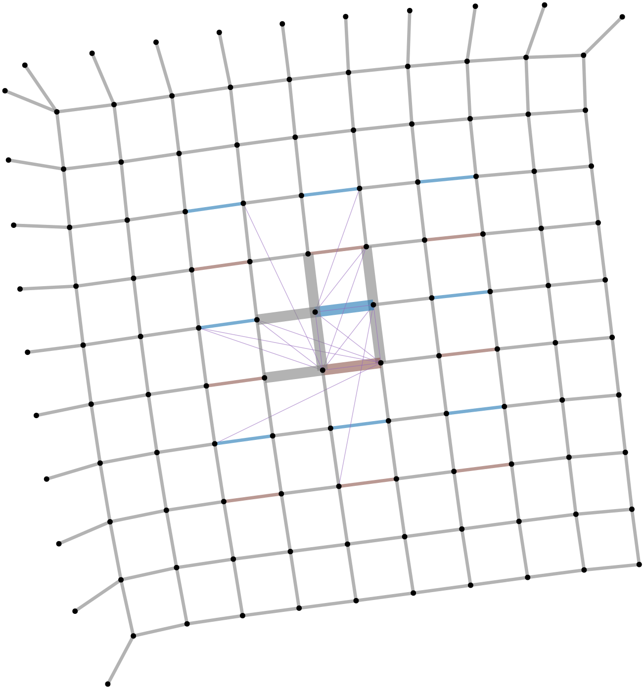
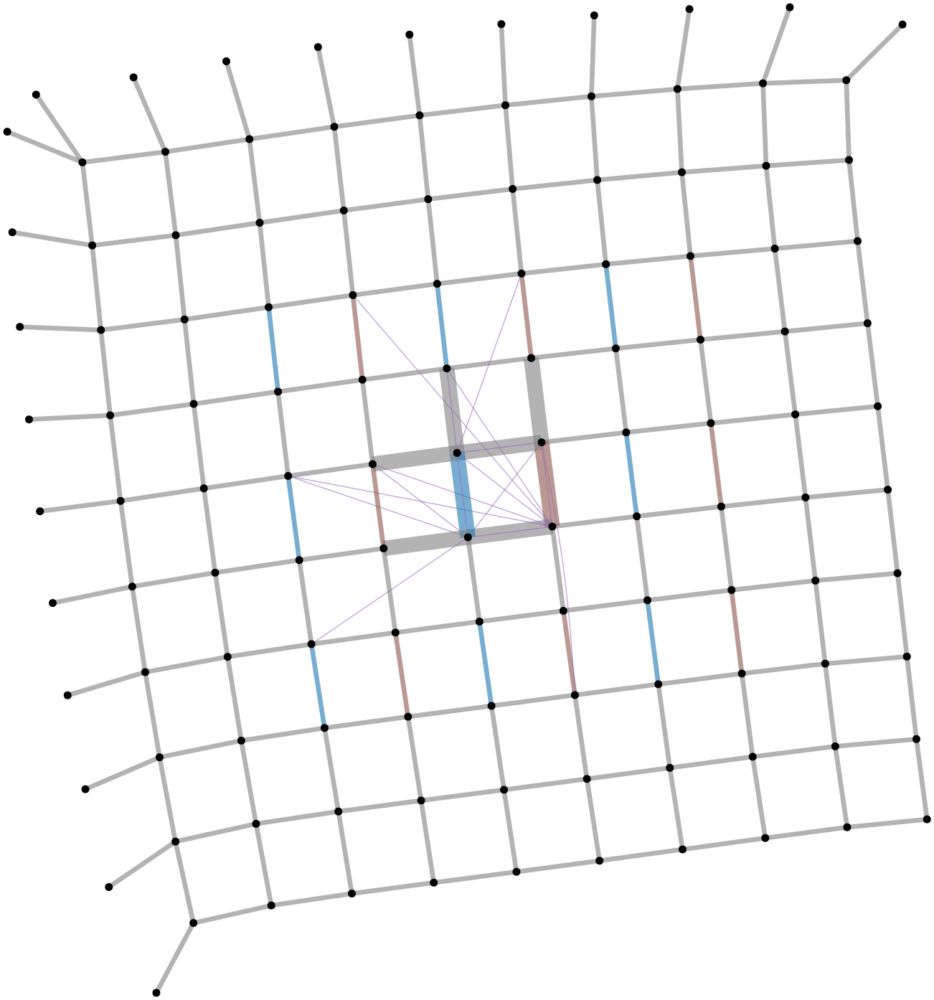
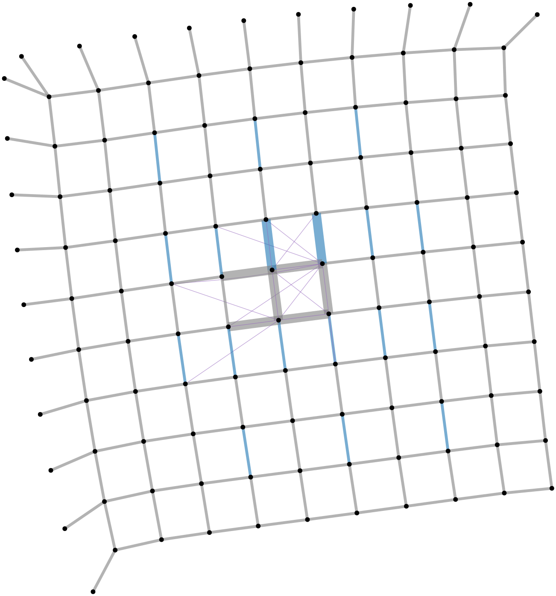
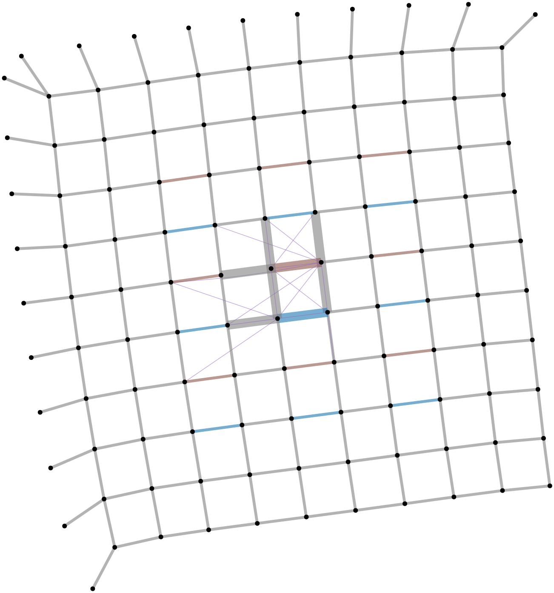
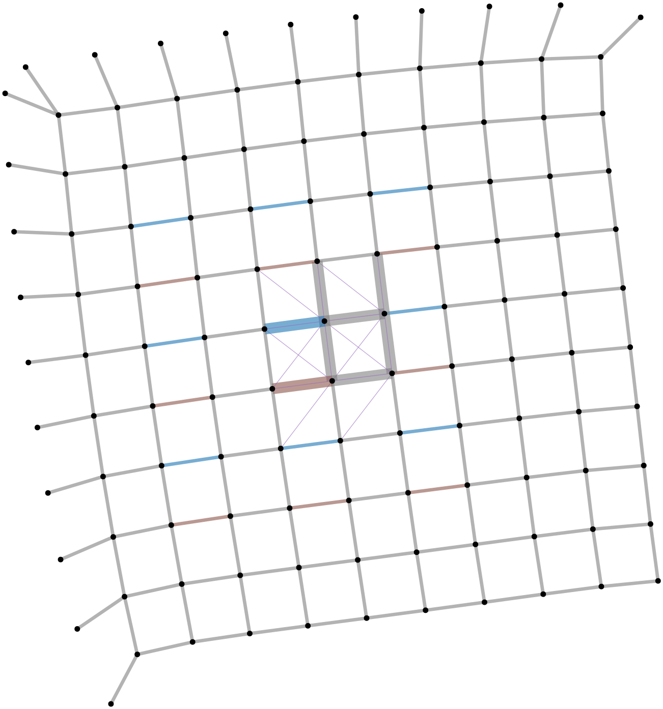
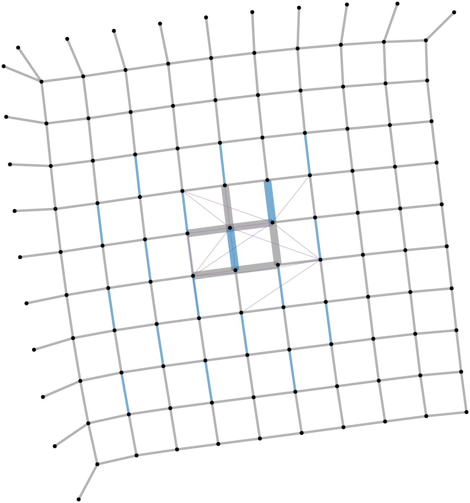
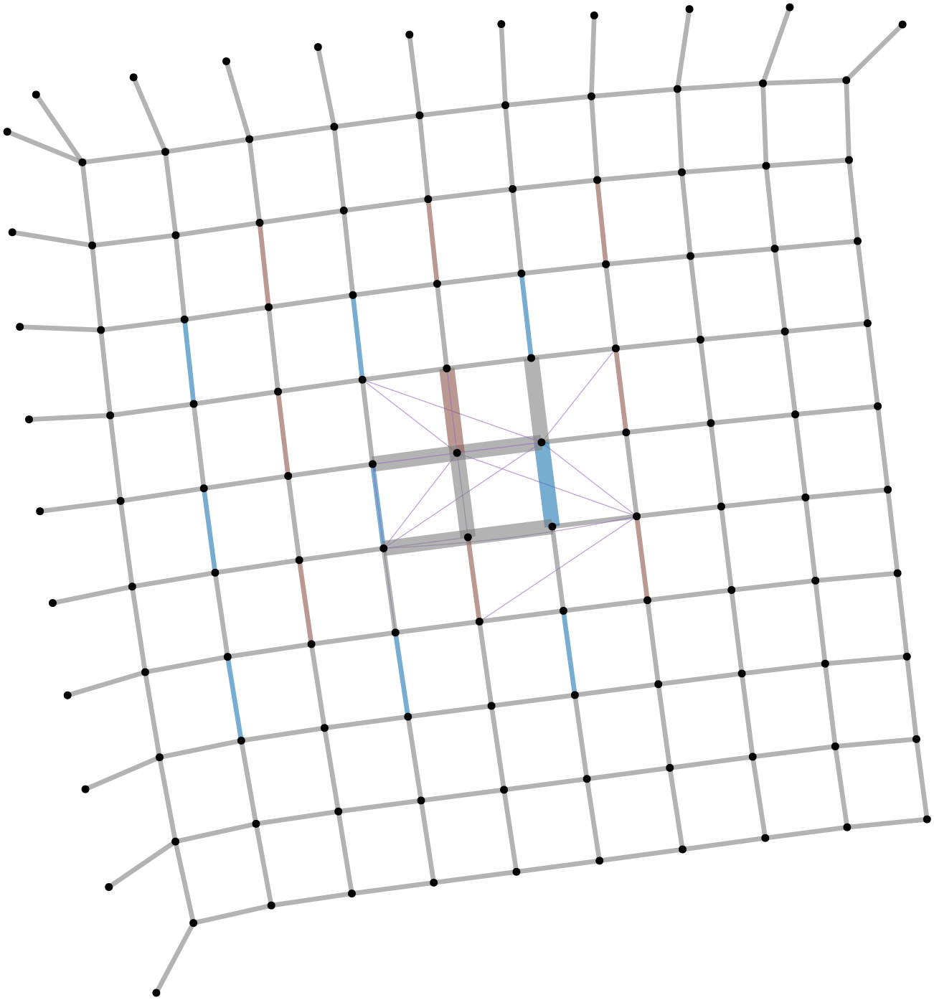
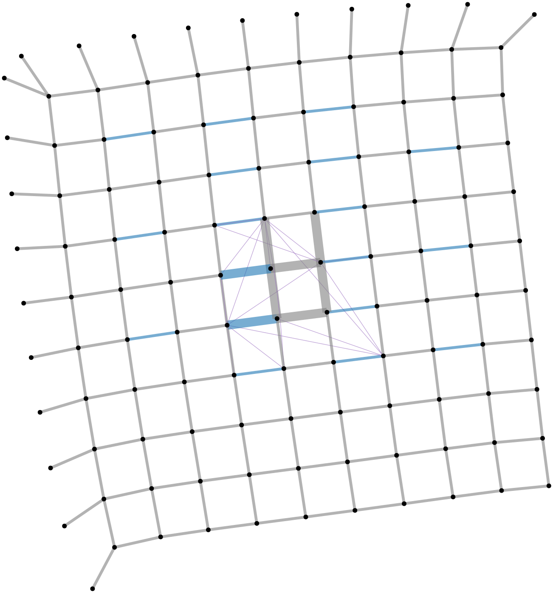

This repository contains the code, data and images for the qubit routing of tillable circuits. For installation instructions, see [installation](#installation). Feedback is appreciated at _physics at kattemolle dot com_. 

# Example
We optimally route a circuit on a line of qubits, with gates to nearest and **next-nearest neighbors**, to quantum hardware with a line of qubits offering only nearest-neighbor connectivity. 
First, we define the qubits in lattice graph notation (see [arXiv:2402.08752](https://arxiv.org/pdf/2402.08752)); `qt.Qubit(x,y,s)` creates a qubit in the cell $(x,y)$ with identifier $s\geq 0$.
The displayed code is in Python 3. 


```python
import quantile as qt
q0 = qt.Qubit(0, 0, 0)
q1 = qt.Qubit(0, 0, 1)
q2 = qt.Qubit(0, 0, 2)
q3 = qt.Qubit(0, 0, 3)
q4 = qt.Qubit(1, 0, 0)
q5 = qt.Qubit(1, 0, 1)
```

We instantiated four qubits in the unit cell (0,0) and two in one unit cell to the right, unit cell (1,0). 

We now define gates with `qt.Gate(name, qubits)`. Here, `name` is a string and `qubits` is a tuple of length 1 or 2 containing the qubits the gate acts on. We will construct our circuit out of generic gates $G$ which, for example, could arise from trotterization of some XXZ model. We could also take CNOTs by setting `name` to `'cx'`. This is the OpenQasm name for a CNOT, ensuring a correct export to OpenQasm, if needed.


```python
gates = [
    qt.Gate("G01", (q0, q1)),
    qt.Gate("G23", (q2, q3)),
    qt.Gate("G12", (q1, q2)),
    qt.Gate("G34", (q3, q4)),
]  # Nearest neighbor gates
gates += [
    qt.Gate("G02", (q0, q2)),
    qt.Gate("G13", (q1, q3)),
    qt.Gate("G24", (q2, q4)),
    qt.Gate("G35", (q3, q5)),
]  # Append next-nearest neighbor gates
```

Instantiate a `BasisCirc` with these gates.


```python
bc = qt.BasisCirc(gates)
```

---
(**Optional**) For visualization, we convert the above circuit to OpenQasm 3, and visualize it with Qiskit. (If you want to run this, first install Qiskit with qasm3 capability by running `pip install qiskit'[qasm3-import]'` or `pip install qiskit[qasm3-import]` in bash. It is not included in the standard installation of QuanTile)


```python
from qiskit.qasm3 import loads

s = bc.to_qasm()
c = loads(s)
wo = [2,0,4,1,5,3] # Just to put the qubits in the correct order for visualization.
print(c.draw(with_layout=False, wire_order=wo))
```

       ┌──────┐        ┌──────┐                        
    2: ┤0     ├────────┤0     ├────────────────────────
       │  G01 │┌──────┐│      │┌──────┐                
    0: ┤1     ├┤0     ├┤  G02 ├┤0     ├────────────────
       ├──────┤│  G12 ││      ││      │┌──────┐        
    4: ┤0     ├┤1     ├┤1     ├┤  G13 ├┤0     ├────────
       │  G23 │├──────┤└──────┘│      ││      │┌──────┐
    1: ┤1     ├┤0     ├────────┤1     ├┤  G24 ├┤0     ├
       └──────┘│  G34 │        └──────┘│      ││      │
    5: ────────┤1     ├────────────────┤1     ├┤  G35 ├
               └──────┘                └──────┘│      │
    3: ────────────────────────────────────────┤1     ├
                                               └──────┘


Basis circuits can be repeated spatially concurrently without causing gate collisions. For example, we can now easily create a circuit patch of 3 by 1 basis circuits. 


```python
c = bc.get_patch(3, 1)
c = c.to_qasm()
c = loads(c)
wo2 = [4, 0, 8, 2, 12, 3, 6, 1, 5, 13, 9, 11, 10, 7] # Just to put the qubits in the correct order for visualization.
print(c.draw(with_layout=False, wire_order=wo2))
```

        ┌──────┐        ┌──────┐                        
     4: ┤0     ├────────┤0     ├────────────────────────
        │  G01 │┌──────┐│      │┌──────┐                
     0: ┤1     ├┤0     ├┤  G02 ├┤0     ├────────────────
        ├──────┤│  G12 ││      ││      │┌──────┐        
     8: ┤0     ├┤1     ├┤1     ├┤  G13 ├┤0     ├────────
        │  G23 │├──────┤└──────┘│      ││      │┌──────┐
     2: ┤1     ├┤0     ├────────┤1     ├┤  G24 ├┤0     ├
        ├──────┤│  G34 │┌──────┐└──────┘│      ││      │
    12: ┤0     ├┤1     ├┤0     ├────────┤1     ├┤  G35 ├
        │  G01 │├──────┤│      │┌──────┐└──────┘│      │
     3: ┤1     ├┤0     ├┤  G02 ├┤0     ├────────┤1     ├
        ├──────┤│  G12 ││      ││      │┌──────┐└──────┘
     6: ┤0     ├┤1     ├┤1     ├┤  G13 ├┤0     ├────────
        │  G23 │├──────┤└──────┘│      ││      │┌──────┐
     1: ┤1     ├┤0     ├────────┤1     ├┤  G24 ├┤0     ├
        ├──────┤│  G34 │┌──────┐└──────┘│      ││      │
     5: ┤0     ├┤1     ├┤0     ├────────┤1     ├┤  G35 ├
        │  G01 │├──────┤│      │┌──────┐└──────┘│      │
    13: ┤1     ├┤0     ├┤  G02 ├┤0     ├────────┤1     ├
        ├──────┤│  G12 ││      ││      │┌──────┐└──────┘
     9: ┤0     ├┤1     ├┤1     ├┤  G13 ├┤0     ├────────
        │  G23 │├──────┤└──────┘│      ││      │┌──────┐
    11: ┤1     ├┤0     ├────────┤1     ├┤  G24 ├┤0     ├
        └──────┘│  G34 │        └──────┘│      ││      │
    10: ────────┤1     ├────────────────┤1     ├┤  G35 ├
                └──────┘                └──────┘│      │
     7: ────────────────────────────────────────┤1     ├
                                                └──────┘


---
To route the basis circuit to hardware with qubits on a line, offering only nearest-neighbor connectivity, we define said connectivity using a list of edges, with which we instantiate a `BasisGraph`. Here, we reuse the already defined qubit objects q0 to q4 for convenience. One is free to use any (new) qubit objects to create the hardware basis graph. 


```python
edges = [
    qt.Edge((q0, q1)),
    qt.Edge((q1, q2)),
    qt.Edge((q2, q3)),
    qt.Edge((q3, q4)),
]
bg = qt.BasisGraph(edges)
```

We can now create a transpiler instance and solve the routing problem depth-optimally.


```python
t = qt.Transpiler(bc, bg)
t.gate_dependencies = False  # Allow the transpiler to reorder the gates, as is allowed, for example, when all gates commute or when we are routing a circuit for trotterized time evolution. The default value is False.
t.merge_swaps = (
    True  # Allow SWAP gates to be merged into two-qubit gates immedeately preceding it.
)
t.minimize_swaps = True # After minimizing the depth, also minimize the number of SWAP gates.
sol = t.solve()
rbc = sol["routed_basis_circ"]
```

    
    Solving
    {'basis_circ': <quantile.base.BasisCirc object at 0x105ba6510>, 'basis_graph': <quantile.base.BasisGraph object at 0x13f10d010>, 'name': 'None --> None', 'solution': None, 'cyclic': False, 'fixed_depth': False, 'gate_dependencies': False, 'merge_swaps': True, 'slice_depth': None, 'init_map': None, 'final_map': None, 'sub_transpiler': False, 'minimize_swaps': True}
    trying depth = 4 ...
    trying depth = 5 ...
    solved


---
(**Optional**) As before, we can visualize the solution.


```python
c = rbc.get_patch(1,1).to_qasm()
c = loads(c)
wo3=[2,0,4,1,5,3]
print(c.draw(with_layout=False, wire_order=wo3))
```

               ┌───────────┐                             
    2: ────────┤1          ├─────────────────────────────
       ┌──────┐│  swap_G01 │┌──────┐             ┌──────┐
    0: ┤0     ├┤0          ├┤0     ├─────────────┤0     ├
       │  G02 │└───────────┘│  G12 │┌───────────┐│  G13 │
    4: ┤1     ├─────────────┤1     ├┤0          ├┤1     ├
       ├──────┤             ├──────┤│  swap_G23 │├──────┤
    1: ┤0     ├─────────────┤0     ├┤1          ├┤0     ├
       │  G35 │             │  G34 │└───────────┘│  G24 │
    5: ┤1     ├──────X──────┤1     ├─────────────┤1     ├
       └──────┘      │      └──────┘             └──────┘
    3: ──────────────X───────────────────────────────────
                                                         


Here, `swap_G` means: first do `G` and then a swap gate. 

The whole point of Quantile is that also the solution can be repeated at will, without gate collisions. (This requires a special treatment of the SWAP gates at the boundaries, but this is a subtle detail, treated in the implementation.) For example, to get the solution for a 3 by 1 patch of the input circuit, we just repeat the above solution 3 (by 1) times


```python
c = rbc.get_patch(3, 1) 
c = c.to_qasm()
c = loads(c)
print(c.draw(with_layout=False, wire_order=wo2))
```

                ┌───────────┐                             
     4: ────────┤1          ├─────────────────────────────
        ┌──────┐│  swap_G01 │┌──────┐             ┌──────┐
     0: ┤0     ├┤0          ├┤0     ├─────────────┤0     ├
        │  G02 │└───────────┘│  G12 │┌───────────┐│  G13 │
     8: ┤1     ├─────────────┤1     ├┤0          ├┤1     ├
        ├──────┤             ├──────┤│  swap_G23 │├──────┤
     2: ┤0     ├─────────────┤0     ├┤1          ├┤0     ├
        │  G35 │┌───────────┐│  G34 │└───────────┘│  G24 │
    12: ┤1     ├┤1          ├┤1     ├─────────────┤1     ├
        ├──────┤│  swap_G01 │├──────┤             ├──────┤
     3: ┤0     ├┤0          ├┤0     ├─────────────┤0     ├
        │  G02 │└───────────┘│  G12 │┌───────────┐│  G13 │
     6: ┤1     ├─────────────┤1     ├┤0          ├┤1     ├
        ├──────┤             ├──────┤│  swap_G23 │├──────┤
     1: ┤0     ├─────────────┤0     ├┤1          ├┤0     ├
        │  G35 │┌───────────┐│  G34 │└───────────┘│  G24 │
     5: ┤1     ├┤1          ├┤1     ├─────────────┤1     ├
        ├──────┤│  swap_G01 │├──────┤             ├──────┤
    13: ┤0     ├┤0          ├┤0     ├─────────────┤0     ├
        │  G02 │└───────────┘│  G12 │┌───────────┐│  G13 │
     9: ┤1     ├─────────────┤1     ├┤0          ├┤1     ├
        ├──────┤             ├──────┤│  swap_G23 │├──────┤
    11: ┤0     ├─────────────┤0     ├┤1          ├┤0     ├
        │  G35 │             │  G34 │└───────────┘│  G24 │
    10: ┤1     ├──────X──────┤1     ├─────────────┤1     ├
        └──────┘      │      └──────┘             └──────┘
     7: ──────────────X───────────────────────────────────
                                                          


---

Practically arbitrarily large solutions can be generated at essentially no computational cost. 

Following the action of the SWAP gates carefully, one can see that, at the end of the routed circuit, the (logical) qubits are not at the location they started at. If it is required that all qubits return to their initial position, for example when routing one cycle of a first-order Suzuki (i.e. 'Lie-Trotter') quantum simulation circuit, set the transpiler option `cyclic` to `True` (`t.cyclic=True`) before running the solver [`t.solve()`]. For creating a higher-order Suzuki quantum simulation circuit, it is not required that the qubits return to their initial position.

For the example above, we create the quantum circuit for the quantum simulation of a $J_1J_2$ model on the line by the `BasisCirc` method `to_suzuki_basis_circ(r, o)`, where `r` is the number of Trotter steps and `o` is the order of the Suzuki formula used. Consider the example where `r=2`, `o=2`. 


```python
rbcs = rbc.to_suzuki_basis_circ(2, 2)
```

    Creating second order circuit
    NOTE: merging gates and gate names. Also updating the QASM unitary is not yet implemented


---
(**Optional**) Visualize a 3 by 1 patch of the circuit


```python
c = rbcs.get_patch(3, 1)
c = c.to_qasm()
c = loads(c)
wo4 = [4,0,8,2,12,3,6,1,5,13,9,11,10,7] # Just to put the qubits in the correct order in visualization.
print(c.draw(with_layout=False,wire_order=wo4))
```

                ┌───────────┐                                                      »
     4: ────────┤1          ├──────────────────────────────────────────────────────»
        ┌──────┐│  swap_G01 │┌──────┐             ┌──────────┐             ┌──────┐»
     0: ┤0     ├┤0          ├┤0     ├─────────────┤0         ├─────────────┤0     ├»
        │  G02 │└───────────┘│  G12 │┌───────────┐│  G13_G13 │┌───────────┐│  G12 │»
     8: ┤1     ├─────────────┤1     ├┤0          ├┤1         ├┤0          ├┤1     ├»
        ├──────┤             ├──────┤│  swap_G23 │├──────────┤│  swap_G23 │├──────┤»
     2: ┤0     ├─────────────┤0     ├┤1          ├┤0         ├┤1          ├┤0     ├»
        │  G35 │┌───────────┐│  G34 │└───────────┘│  G24_G24 │└───────────┘│  G34 │»
    12: ┤1     ├┤1          ├┤1     ├─────────────┤1         ├─────────────┤1     ├»
        ├──────┤│  swap_G01 │├──────┤             ├──────────┤             ├──────┤»
     3: ┤0     ├┤0          ├┤0     ├─────────────┤0         ├─────────────┤0     ├»
        │  G02 │└───────────┘│  G12 │┌───────────┐│  G13_G13 │┌───────────┐│  G12 │»
     6: ┤1     ├─────────────┤1     ├┤0          ├┤1         ├┤0          ├┤1     ├»
        ├──────┤             ├──────┤│  swap_G23 │├──────────┤│  swap_G23 │├──────┤»
     1: ┤0     ├─────────────┤0     ├┤1          ├┤0         ├┤1          ├┤0     ├»
        │  G35 │┌───────────┐│  G34 │└───────────┘│  G24_G24 │└───────────┘│  G34 │»
     5: ┤1     ├┤1          ├┤1     ├─────────────┤1         ├─────────────┤1     ├»
        ├──────┤│  swap_G01 │├──────┤             ├──────────┤             ├──────┤»
    13: ┤0     ├┤0          ├┤0     ├─────────────┤0         ├─────────────┤0     ├»
        │  G02 │└───────────┘│  G12 │┌───────────┐│  G13_G13 │┌───────────┐│  G12 │»
     9: ┤1     ├─────────────┤1     ├┤0          ├┤1         ├┤0          ├┤1     ├»
        ├──────┤             ├──────┤│  swap_G23 │├──────────┤│  swap_G23 │├──────┤»
    11: ┤0     ├─────────────┤0     ├┤1          ├┤0         ├┤1          ├┤0     ├»
        │  G35 │             │  G34 │└───────────┘│  G24_G24 │└───────────┘│  G34 │»
    10: ┤1     ├──────X──────┤1     ├─────────────┤1         ├─────────────┤1     ├»
        └──────┘      │      └──────┘             └──────────┘             └──────┘»
     7: ──────────────X────────────────────────────────────────────────────────────»
                                                                                   »
    «    ┌───────────┐            ┌───────────┐                                 »
    « 4: ┤1          ├────────────┤1          ├─────────────────────────────────»
    «    │  swap_G01 │┌──────────┐│  swap_G01 │┌──────┐             ┌──────────┐»
    « 0: ┤0          ├┤0         ├┤0          ├┤0     ├─────────────┤0         ├»
    «    └───────────┘│  G02_G02 │└───────────┘│  G12 │┌───────────┐│  G13_G13 │»
    « 8: ─────────────┤1         ├─────────────┤1     ├┤0          ├┤1         ├»
    «                 ├──────────┤             ├──────┤│  swap_G23 │├──────────┤»
    « 2: ─────────────┤0         ├─────────────┤0     ├┤1          ├┤0         ├»
    «    ┌───────────┐│  G35_G35 │┌───────────┐│  G34 │└───────────┘│  G24_G24 │»
    «12: ┤1          ├┤1         ├┤1          ├┤1     ├─────────────┤1         ├»
    «    │  swap_G01 │├──────────┤│  swap_G01 │├──────┤             ├──────────┤»
    « 3: ┤0          ├┤0         ├┤0          ├┤0     ├─────────────┤0         ├»
    «    └───────────┘│  G02_G02 │└───────────┘│  G12 │┌───────────┐│  G13_G13 │»
    « 6: ─────────────┤1         ├─────────────┤1     ├┤0          ├┤1         ├»
    «                 ├──────────┤             ├──────┤│  swap_G23 │├──────────┤»
    « 1: ─────────────┤0         ├─────────────┤0     ├┤1          ├┤0         ├»
    «    ┌───────────┐│  G35_G35 │┌───────────┐│  G34 │└───────────┘│  G24_G24 │»
    « 5: ┤1          ├┤1         ├┤1          ├┤1     ├─────────────┤1         ├»
    «    │  swap_G01 │├──────────┤│  swap_G01 │├──────┤             ├──────────┤»
    «13: ┤0          ├┤0         ├┤0          ├┤0     ├─────────────┤0         ├»
    «    └───────────┘│  G02_G02 │└───────────┘│  G12 │┌───────────┐│  G13_G13 │»
    « 9: ─────────────┤1         ├─────────────┤1     ├┤0          ├┤1         ├»
    «                 ├──────────┤             ├──────┤│  swap_G23 │├──────────┤»
    «11: ─────────────┤0         ├─────────────┤0     ├┤1          ├┤0         ├»
    «                 │  G35_G35 │             │  G34 │└───────────┘│  G24_G24 │»
    «10: ──────X──────┤1         ├──────X──────┤1     ├─────────────┤1         ├»
    «          │      └──────────┘      │      └──────┘             └──────────┘»
    « 7: ──────X────────────────────────X───────────────────────────────────────»
    «                                                                           »
    «                         ┌───────────┐        
    « 4: ─────────────────────┤1          ├────────
    «                 ┌──────┐│  swap_G01 │┌──────┐
    « 0: ─────────────┤0     ├┤0          ├┤0     ├
    «    ┌───────────┐│  G12 │└───────────┘│  G02 │
    « 8: ┤0          ├┤1     ├─────────────┤1     ├
    «    │  swap_G23 │├──────┤             ├──────┤
    « 2: ┤1          ├┤0     ├─────────────┤0     ├
    «    └───────────┘│  G34 │┌───────────┐│  G35 │
    «12: ─────────────┤1     ├┤1          ├┤1     ├
    «                 ├──────┤│  swap_G01 │├──────┤
    « 3: ─────────────┤0     ├┤0          ├┤0     ├
    «    ┌───────────┐│  G12 │└───────────┘│  G02 │
    « 6: ┤0          ├┤1     ├─────────────┤1     ├
    «    │  swap_G23 │├──────┤             ├──────┤
    « 1: ┤1          ├┤0     ├─────────────┤0     ├
    «    └───────────┘│  G34 │┌───────────┐│  G35 │
    « 5: ─────────────┤1     ├┤1          ├┤1     ├
    «                 ├──────┤│  swap_G01 │├──────┤
    «13: ─────────────┤0     ├┤0          ├┤0     ├
    «    ┌───────────┐│  G12 │└───────────┘│  G02 │
    « 9: ┤0          ├┤1     ├─────────────┤1     ├
    «    │  swap_G23 │├──────┤             ├──────┤
    «11: ┤1          ├┤0     ├─────────────┤0     ├
    «    └───────────┘│  G34 │             │  G35 │
    «10: ─────────────┤1     ├──────X──────┤1     ├
    «                 └──────┘      │      └──────┘
    « 7: ───────────────────────────X──────────────
    «                                              


---
To show the power of quantile, consider a circuit that consists out of, say, 100 spatial repetitions of the input basis circuit. Note that these repeated basis circuits are 'intertwined' and do not act on disjoint sets of qubits. We can simply repeat the already obtained solution spatially 100 times. 


```python
from time import time

start = time()
c = rbc.get_patch(100, 1)
end = time()
print(end - start, "seconds")
print(c.n, "qubits")
print("depth", c.get_tmax() + 1, "layers")
```

    1.349153757095337 seconds
    402 qubits
    depth 5 layers


## Two-body quantum simulation circuits

The above process of routing the quantum circuit for the quantum simulation of a two-body Hamiltonian is automatized by the function `qt.route_qsim`. The required arguments are as follows.

- `basis_circuit_name` (str) Name of a _basis graph_ defined in `basis_graphs.json`. This basis graph is converted to a basis circuit $C$ by putting a gate $G$ on every edge of the basis graph. 
- `basis_circuit_size` (tuple (int)) The basis circuit $C$ is resized to size `basis_circuit_size` in terms of circuit tiles. This resized circuit forms the input to the routing method.
- `basis_graph_name` (str) Name of a basis graph defined in `basis_graphs.json`.
- `basis_graph_size` (tuple (int)) Size of the basis graph in terms of the number of basis graphs. Must be a tuple of two integers. The basis graph `basis_graph_name`, resized to the size `basis_graph_size`, defines the (spatially periodic) connectivity of the target hardware.

The function `qt.route_qsim` returns a transpiler object, which has the solution of the routing problem stored at `t.solution`. The transpiler options are set as in the example above. 

Let us illustrate `qt.route_qsim` by again routing the circuit with a gate $G$ added for all neighbor- and all next-nearest-neighbor qubits of a collection of qubits on a line. (That is, the circuit for one trotter step of a $J_1J_2$ model on a line). We route this circuit to quantum hardware which offers qubits on a line with nearest-neighbour connectivity only. From the solution, we create a second order Suzuki circuit with two repetitions and create a 3 by 1 patch of the routed circuit. 


```python
t = qt.route_qsim("J1J2-line", (4, 1), "line", (4, 1))
rbc = t.solution["routed_basis_circ"]
rbcs = rbc.to_suzuki_basis_circ(2, 2)
c = rbcs.get_patch(3,1)
```

    
    Solving
    {'basis_circ': <quantile.base.BasisCirc object at 0x145939580>, 'basis_graph': <quantile.base.BasisGraph object at 0x1459381d0>, 'name': 'J1J2-line(4,1) --> line(4,1)', 'solution': None, 'cyclic': False, 'fixed_depth': False, 'gate_dependencies': False, 'merge_swaps': True, 'slice_depth': None, 'init_map': None, 'final_map': None, 'sub_transpiler': False, 'minimize_swaps': False}
    trying depth = 4 ...
    trying depth = 5 ...
    solved
    Creating second order circuit
    NOTE: merging gates and gate names. Also updating the QASM unitary is not yet implemented


(Although a `basis_circuit_size` of `(3,1)` suffices to gate a valid, tilable basis circuit as input to the routing problem, we take a `basis_circuit_size` of `(4, 1)` to obtain a slightly better solution). The solution is as before. 

To go beyond the above example, consider, e.g., the circuit for the quantum simulation of a $J_1 J_2$ model on a square grid, which is to be routed to quantum hardware with nearest-neighbour grid connectivity. (We need to take a `basis_circuit_size` and `basis_graph_size` of at least `(2,2)`, for otherwise the resulting basis circuit is not tilable.) Note that each spin in a $J_1J_2$ model on the square grid interacts with 8 other spins, so that the input circuit to the routing problem has depth at least 8. Routing this circuit may take a couple of minutes, but, as before, when a solution is obtained, this solution can be tiled at will as essentially no cost. 


```python
t = qt.route_qsim("J1J2-square", (2, 2), "square", (2, 2))
print("depth", t.solution["depth"])
```

    
    Solving
    {'basis_circ': <quantile.base.BasisCirc object at 0x140fc30e0>, 'basis_graph': <quantile.base.BasisGraph object at 0x13f12d2b0>, 'name': 'J1J2-square(2,2) --> square(2,2)', 'solution': None, 'cyclic': False, 'fixed_depth': False, 'gate_dependencies': False, 'merge_swaps': True, 'slice_depth': None, 'init_map': None, 'final_map': None, 'sub_transpiler': False, 'minimize_swaps': False}
    trying depth = 8 ...
    solved
    depth 8


Remarkably, assuming SWAP gates can be merged into preceding two-qubit gates acting on the same qubits, there is no depth overhead in the current routing problem.

For these 2D circuits, circuit diagrams become illegible. We offer the following method for visualization.  


```python
t.plot_solution()
```

which gives the images

<br>
<br>
<br>
<br>
<br>
<br>
<br>


Here, blue edges correspond to gates $G$ and brown edges to gates $\mathrm{SWAP}\,G$. The routed basis circuit, which is to be repeated to obtain larger solutions, is displayed with thick edges. For the hardware connectivity graph, 5 by 5 tiles are shown. The thin purple lines show one basis graph on which the input basis circuit is defined (the "diagonal lattice"), with logical qubits on its vertices. It may not always look like the diagonal lattice to the eye.

Again, to obtain the routed, second order Suzuki circuit with two repetitions, with a spatial circuit size of 3 by 3 routed basis circuits, run 


```python
rbc = t.solution["routed_basis_circ"]
rbcs = rbc.to_suzuki_basis_circ(2, 2)
c = rbcs.get_patch(3,3)
```

    Creating second order circuit
    NOTE: merging gates and gate names. Also updating the QASM unitary is not yet implemented


# Precomputed solutions

NOTE: These will be added later. 

Entire transpiler objects, containing the input basis circuits, input basis graphs, and the routing solutions, can then be unpickled. Only use this if you trust the pickled objects.


```python
db = (
    qt.load_solution_database()
)  # This (and only this) loads the pickle module and unpickles circuits/solutions.pkl
for group in db:  # Show the different groups of transpiler objects available
    print(group)
t = db["two-qudit"][0]  # Load the first transpiler object in the two-qudit group.
print(t.name)
rbc = t.solution[
    "routed_basis_circ"
]  # Load the routed basis circuit as a qt.BasisCirc object.
print(rbc.gates)
```

For readability and interoperability, routing solutions (but also patches thereof) can be exported to OpenQASM 3 as shown before. 


```python
print(rbc.to_qasm())
```

    OPENQASM 3;
    include "stdgates.inc";
    
    // declare qubits
    qubit q_0_0_1;
    qubit q_1_0_3;
    qubit q_0_0_3;
    qubit q_1_1_3;
    qubit q_0_min1_1;
    qubit q_0_0_0;
    qubit q_0_1_2;
    qubit q_1_0_1;
    qubit q_0_0_2;
    qubit q_min1_0_0;
    qubit q_1_min1_1;
    
    // declare gates
    gate G a, b
    {
      id a;
      id b;
    }
    gate swap_G a, b
    {
      id a;
      id b;
      swap a,b;
    }
    
    // circuit
    G q_0_0_3, q_0_0_1;
    G q_0_0_0, q_0_0_2;
    G q_0_0_3, q_0_min1_1;
    G q_0_0_0, q_0_1_2;
    swap_G q_0_0_0, q_0_0_1;
    G q_0_0_3, q_0_0_2;
    swap_G q_0_0_3, q_0_0_1;
    swap_G q_0_0_2, q_0_0_0;
    swap_G q_0_0_0, q_1_0_1;
    G q_0_0_2, q_1_0_3;
    swap_G q_0_0_2, q_0_0_0;
    swap_G q_1_0_1, q_1_0_3;
    G q_1_0_3, q_1_min1_1;
    swap_G q_0_0_0, q_0_1_2;
    G q_0_1_2, q_1_1_3;
    G q_0_0_1, q_min1_0_0;
    


<h1 id="installation">Installation</h1>

## TL;DR 
If you have git and anconda/miniconda installed, in a terminal, run 

``` bash
git clone https://github.com/kattemolle/quantile.git 
cd quantile
conda env create --file environment.yml
conda activate quantile
```
After that, you should be able to run the example above without the optional parts. If you want to run the optional parts, also install Qiskit with `pip install qiskit[qasm3-import]` or `pip install qiskit'[qasm3-import]'` in bash. 

## More info
Download and unpack the repository. Or, if you have git, run

``` bash
git clone https://github.com/kattemolle/quantile.git 
```
Our implementation is written in Python 3, relying on:

- networkx
- z3-solver
- numpy
- graphviz
- pygraphviz

Installing these programs and packages manually will possibly just work fine. However, it is possibly easiest to install [anaconda](https://docs.anaconda.com/free/anaconda/install/mac-os/) or [miniconda](https://docs.conda.io/projects/miniconda/en/latest/miniconda-install.html). After that, in a bash terminal, change the directory to the base directory of the quantile repository, and run

```bash
conda env create --file environment/environment.yml
conda activate quantile
```

We recommend the use of `environment/environment.yml`. 

# How to cite

``` bibtex
@software{kattemolle2024quantile,
  author       = {Kattem\"olle, Joris},
  title        = {QuanTile},
  month        = oct,
  year         = 2024,
  publisher    = {Zenodo},
  doi          = {10.5281/zenodo.14336692}
}
```

